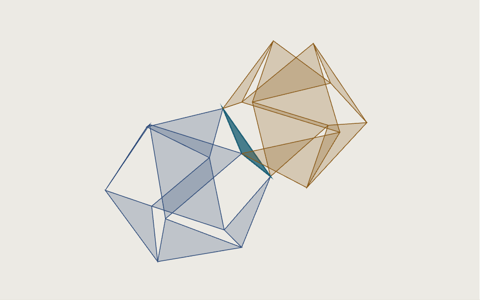
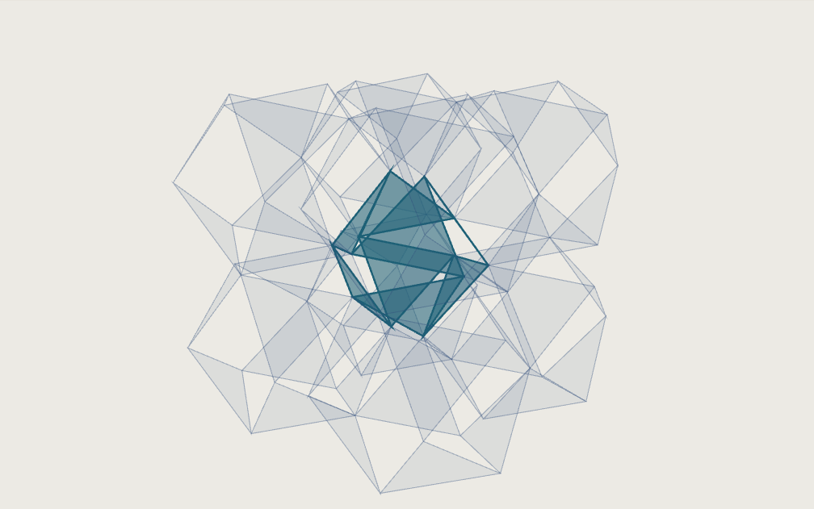
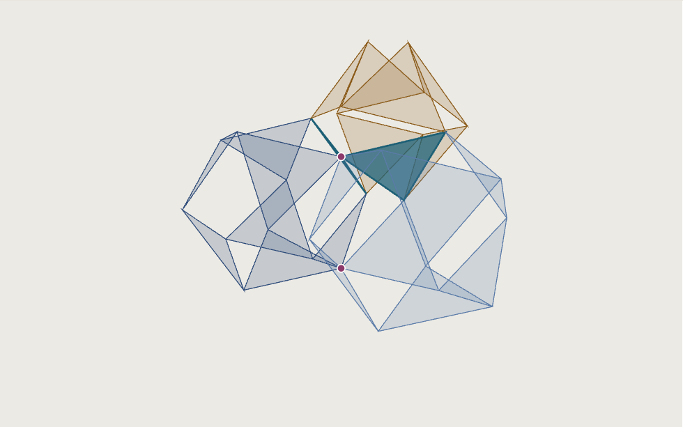
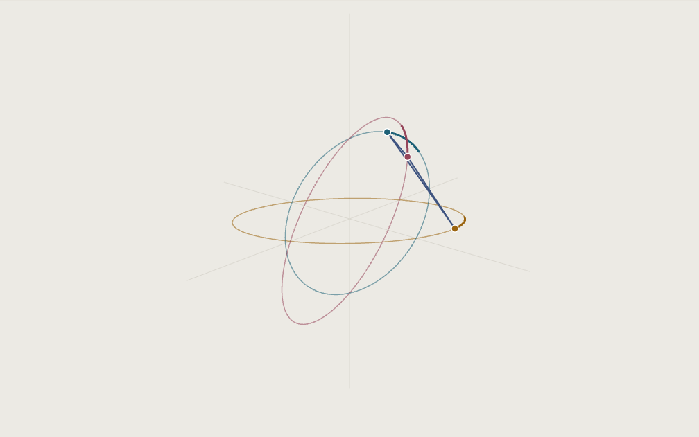

# Inviscid

Cellular automata built from **jitterbugs** — Buckminster Fuller's transformation
in which a cuboctahedron (the *vector equilibrium*, or VE) folds into an
octahedron by rotating its eight triangular faces in place. This repository
explores what happens when space is tiled with jitterbug cells that share faces:
a lattice with exactly one internal motion, animated in JavaFX 3D and derived
from first principles in a gated Python analysis suite.

## What's here

| part | language | what it is |
|---|---|---|
| `src/main/java` | Java | The cellular automaton (`Necronomata`), jitterbug geometry, and JavaFX 3D animation apps |
| `analysis/` | Python | The model of record for the jitterbug medium: rigid struts, soft joints, every claim a self-gating script |
| `docs/honeycomb/` | HTML | Self-contained interactive figures of the honeycomb packing — open in any browser, no build |

## The model in one paragraph

Cells sit on a cubic lattice, one VE per all-even site, welded face to face to
its six axis neighbours. The octahedral holes between them are empty voids —
but each void is bounded by plates of the surrounding VEs, so it is itself a
jitterbug, running 60° ahead of the cells. The tied array has one coherent
motion: a 60° arc of the fold angle with an octahedron at each end. Everything
else — two sound speeds in the ratio √2, seven phonon bands, what happens when
you drive the fold past its dead ends ("overdrive": the whole lattice collapses
onto a single octahedron and turns inside out) — is measured from that model in
`analysis/`, with the derivation's map in
[`analysis/README.md`](analysis/README.md).

## See it in the browser

The honeycomb figures are live at
**[chiralbehaviors.github.io/inviscid](https://chiralbehaviors.github.io/inviscid/)** —
each is a self-contained interactive page (drag to rotate, scroll to zoom):

| | |
|---|---|
| [](https://chiralbehaviors.github.io/inviscid/honeycomb/exchange.html) | **[The Exchange](https://chiralbehaviors.github.io/inviscid/honeycomb/exchange.html)** — a VE and an octahedral hole cell on one shared face: as one closes the other opens, `b = a + 60°`, driven to the full swap |
| [](https://chiralbehaviors.github.io/inviscid/honeycomb/eight.html) | **[Eight around one](https://chiralbehaviors.github.io/inviscid/honeycomb/eight.html)** — one octahedral cell with its full complement of eight VEs; the whole cluster turns inside out |
| [](https://chiralbehaviors.github.io/inviscid/honeycomb/three.html) | **[VE — hole — VE](https://chiralbehaviors.github.io/inviscid/honeycomb/three.html)** — the reciprocal condition, and the square contact decaying 4 → 2 → 1 |
| [](https://chiralbehaviors.github.io/inviscid/honeycomb/orbits.html) | **[Orbits of a Jitterbug](https://chiralbehaviors.github.io/inviscid/honeycomb/orbits.html)** — one face riding its three vertex ellipses, with the exact constants |

(A fifth page, [edge contact](https://chiralbehaviors.github.io/inviscid/honeycomb/edge.html),
shows a superseded vertex-touching packing — kept as the record of a corrected
mistake.)

From the first-principles derivation:
**[Overdrive, Fifteen Bodies](https://chiralbehaviors.github.io/inviscid/overdrive/hc15.html)** —
one VE with its complete neighbourhood (eight voids, six axis VEs) driven
through a full 360° of the fold, far past the 60° physics allows: the whole
patch collapses onto one octahedron and turns inside out.

## Run the animations (Java)

Requires JDK 20+ (JavaFX 20, `source`/`target` 20).

```
mvn compile        # build
mvn test           # the automaton model tests (headless)
```

No exec plugin is configured — run an app's `main` method from your IDE or the
classpath. Entry points:

- `com.chiralbehaviors.inviscid.animations.HoneycombBreatheAnimation` — a honeycomb patch doing the medium's one motion, bounded by elastic contact
- `com.chiralbehaviors.inviscid.animations.ThreeCellPhaseAnimation` — three cells with independent phases, integrated in reduced coordinates
- `com.chiralbehaviors.inviscid.animations.JitterbugAnimation` — one jitterbug
- `com.chiralbehaviors.inviscid.animations.NecronomataAnimation` — the cellular automaton
- `com.javafx.experiments.jfx3dviewer.Jfx3dViewerApp` — generic 3D viewer

The Java tree has three layers: the project's own code
(`com.chiralbehaviors.inviscid`), a vendored polyhedra geometry library
(`mesh.*`, `math.*`, `util.*`), and Oracle's vendored JavaFX 3D sample viewer
(`com.javafx.experiments.*`). The vendored layers are treated as third-party.

## Run the analysis (Python)

Requires Python 3.13 with numpy and scipy. Every module prints `PASS`/`FAIL`
rows and its exit code is the verdict:

```
analysis/gates.sh                    # every gate
analysis/gates.sh live               # the model of record only
python -m analysis.model.dispersion  # one module
```

`analysis/model/first_principles/pages/` exports interactive HTML pages of the
derivation's steps ("One Jitterbug", "The Exchange", "Overdrive", …): run an
`export_*` module, then `python -m analysis.model.first_principles.pages.build`
writes self-contained pages to `analysis/.pages/`.

## License

[Apache 2.0](LICENSE).
